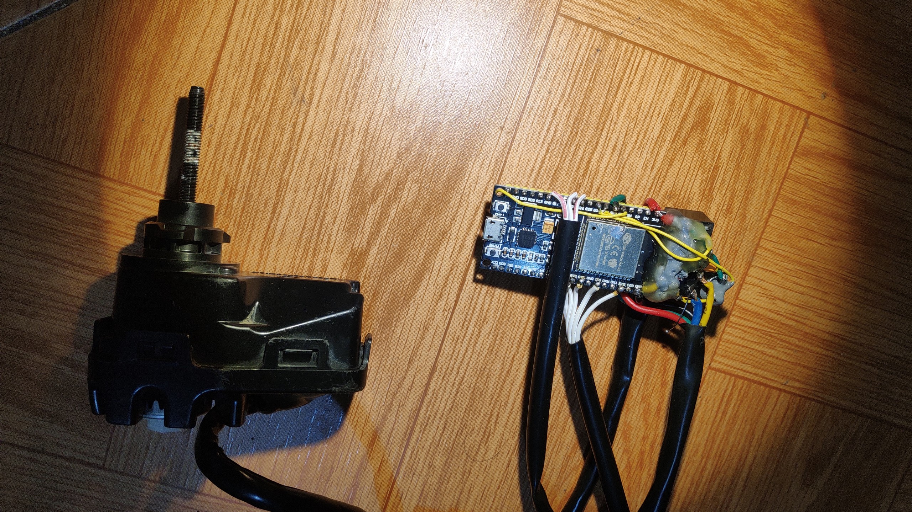

Headlight Controller Library - [](https://raw.githubusercontent.com/trantuananh1996/HeadlightController/master/LICENSE) [](https://github.com/trantuananh1996/HeadlightController/stargazers) [](https://github.com/trantuananh1996/HeadlightController/issues)
========================================

 

Headlight leveling control with memory
* Take a look at this [youtube video](https://www.youtube.com/watch?v=vMRTmk7wKIQ) to see how it work

*Special thanks to all author of libraries used in this repository*

Repository Contents
-------------------

* **/examples** - Example sketches for the library (.ino). Run these from the Arduino IDE.
* **/src** - Source files for the library (.cpp, .h).
* **keywords.txt** - Keywords from this library that will be highlighted in the Arduino IDE. 
* **library.properties** - General library properties for the Arduino package manager. 

Basic Usage
-------------------

* **DO NOT block loop while headlight is running**
* **Define pin** - Example for NodeMCU esp32
```c++
int headlightActivePin = 32;
int headlightReversePin = 33;
int headlightPositionPin = 35;

int headlightUpButtonPin = 26;
int headlightDownButtonPin = 27;

``` 

 * **setup()** - Put this inside setup function, base on your need
```c++
//Basic setup
HeadlightController.setupHeadlight(headlightActivePin, headlightReversePin, headlightPositionPin);
//Enable physical button control
HeadlightController.setupButton(headlightUpButtonPin, headlightDownButtonPin);
//Enable web control
HeadlightController.setupWebControl(server);

``` 

* **loop()** - Put this inside loop function.

```c++
HeadlightController.loop();

``` 

Example Briefs
--------------

* **ESP32_HeadlightControllerSample** - An example running on NodeMCU Esp32, with OTA capability for further update


External library
-------------------------

* **[MultiButton](https://github.com/poelstra/arduino-multi-button)** - A library for multiple button event detection.
* **[SimpleKalmanFilter](https://github.com/denyssene/SimpleKalmanFilter)** - A great library to filter ADC noise.
* **[AsyncElegantOTA](https://github.com/ayushsharma82/AsyncElegantOTA)** - A great library for firmware update.


Version History
---------------

* [V0.1.0](https://github.com/trantuananh1996/HeadlightController) -- Initial commit


License Information
-------------------

This is an _**open source**_ project! 

Please review the LICENSE file for license information. 

If you have any questions or concerns on licensing, please contact trantuananh1996@gmail.com.
